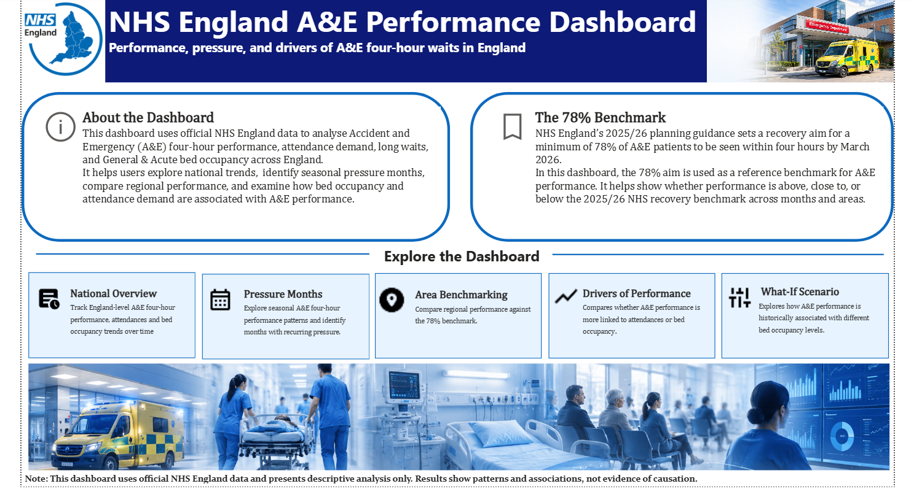
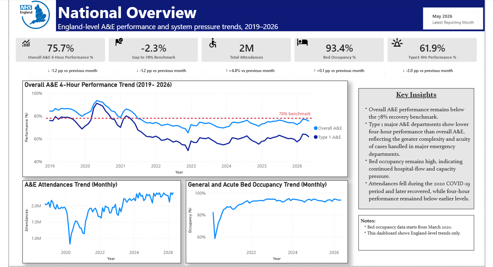
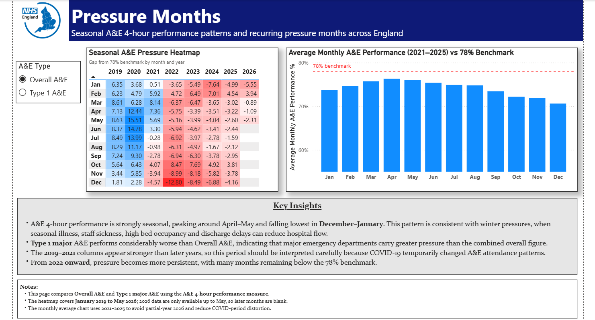
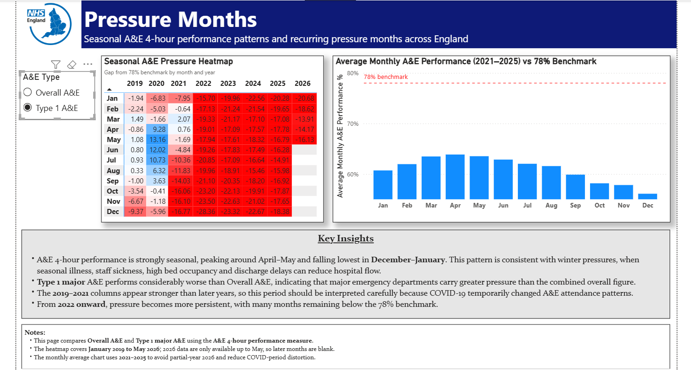
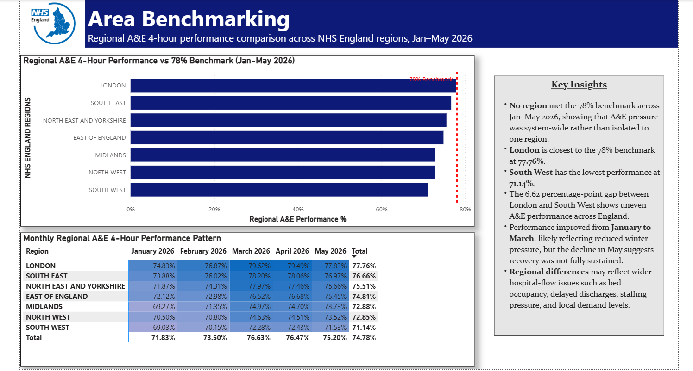
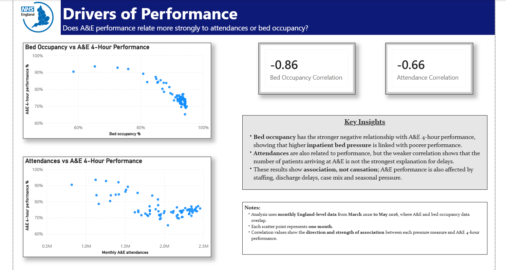
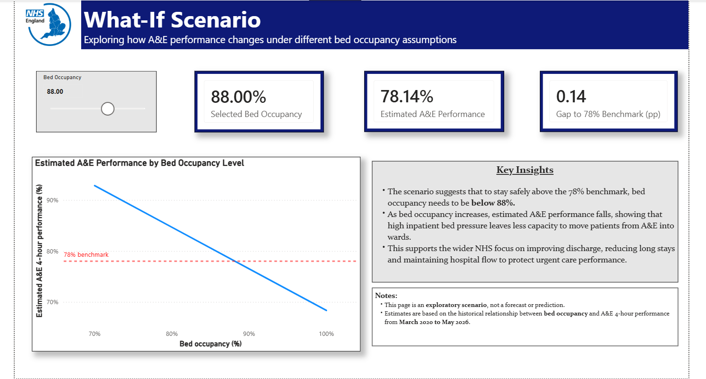

# 🏥 NHS A&E Performance Dashboard


---

## 📌 Project Overview

This Power BI dashboard analyses **NHS England Accident & Emergency (A&E) 4-hour performance** using official public NHS England data.

The dashboard provides a clear view of national A&E performance trends, regional variation, seasonal pressure patterns, and the relationship between A&E performance and operational pressure indicators such as **attendances** and **bed occupancy**.

The aim is to present NHS England A&E performance data in a clear and accessible way, helping users understand key trends, regional differences, seasonal patterns, and operational pressures.

The analysis is descriptive and focuses on identifying patterns, comparisons, and associations within the data. It does not claim to prove causation.

---

## 🎯 Main Objectives

- Analyse NHS England A&E 4-hour performance over time.
- Compare A&E performance across NHS England regions.
- Identify seasonal pressure patterns and weaker performance months.
- Explore whether A&E performance is more closely linked to attendances or bed occupancy.
- Use a simple scenario page to show historical performance associated with different bed occupancy levels.

---

## 📊 Dashboard Preview

### 1. Home Page



### 2. National Overview



### 3. Pressure Months





### 4. Area Benchmarking



### 5. Drivers of Performance



### 6. What-if Scenario



---

## 🧭 Dashboard Pages

| Page | Purpose |
|---|---|
|  **Home** | Introduces the dashboard and provides navigation to all report pages |
|  **National Overview** | Shows national A&E performance, attendances, bed occupancy, and latest reporting month |
|  **Pressure Months** | Identifies monthly and seasonal pressure patterns in A&E performance |
|  **Area Benchmarking** | Compares regional A&E 4-hour performance across NHS England regions |
|  **Drivers of Performance** | Explores whether A&E performance is more strongly associated with attendances or bed occupancy |
|  **What-if Scenario** | Shows historical A&E performance associated with selected bed occupancy levels |

---

## 💡 Key Insights

The dashboard shows that NHS England A&E 4-hour performance remains below the **78% benchmark**, indicating continued pressure across A&E services. Type 1 major A&E departments perform worse than overall A&E, suggesting that major departments face greater pressure due to more complex cases and hospital-flow challenges.

The analysis shows clear seasonal variation, with weaker performance during winter months and improvement around spring. Regional benchmarking for January to May 2026 shows that no NHS England region met the benchmark across the full period. London was closest at **77.76%**, while the South West had the lowest performance at **71.14%**.

The drivers analysis suggests that bed occupancy has a stronger negative relationship with A&E performance than attendance volume. This indicates that hospital capacity and patient flow may be more important factors than patient arrivals alone. The What-if Scenario page further shows how different bed occupancy levels are historically associated with changes in A&E performance.

Overall, the dashboard highlights that A&E performance pressure is linked to seasonal demand, regional variation, and bed occupancy.

---

## 🛠️ Tools and Skills Used

| Area | Tools / Skills |
|---|---|
| Dashboard Development | Power BI Desktop |
| Data Preparation | Power Query for data cleaning and transformation |
| Calculations | DAX measures, KPI calculations, benchmark gaps, and correlations |
| Data Modelling | Data model design, relationships, and date table usage |
| Analysis | Trend analysis, regional comparison, benchmarking, and correlation analysis |
| Visualisation | Cards, line charts, bar charts, pivot/matrix-style tables, slicers, and scatter plots |

---

## 📂 Data Sources

This dashboard uses official public datasets published by **NHS England**.

### 1. A&E Attendances and Emergency Admissions

Used for A&E attendances, emergency admissions, 4-hour performance, national trends, and regional analysis.

**Files used:**

- Monthly A&E Time Series, May 2026
- Monthly A&E Attendances and Emergency Admissions 2026–27 CSV files for January to May 2026

**Source:** [NHS England – A&E Attendances and Emergency Admissions](https://www.england.nhs.uk/statistics/statistical-work-areas/ae-waiting-times-and-activity/)

### 2. Critical Care and General & Acute Beds

Used for bed occupancy analysis from March 2020 to May 2026.

**File used:**

- Beds-publication-Timeseries-March-2020-May-2026

**Source:** [NHS England – Critical Care and General & Acute Beds](https://www.england.nhs.uk/statistics/statistical-work-areas/bed-availability-and-occupancy/critical-care-and-general-acute-beds-urgent-and-emergency-care-daily-situation-reports/)

---


## 📁 Repository Structure

```text
NHS-A-E-Performance-Dashboard/
│
├── NHS_AE_Performance_Dashboard.pbix
├── README.md
│
└── screenshots/
    ├── home.png
    ├── national_overview.png
    ├── Pressure_Months_one.png
    ├── Pressure_Months_two.png
    ├── area_benchmarking.png
    ├── Drivers_of_Performance.png
    └── What_if_Scenario.png
```

## ▶️ How to Use This Project

1. Download the `NHS_AE_Performance_Dashboard.pbix` file from this repository.
2. Open it using **Power BI Desktop**.
3. Use the dashboard navigation buttons to move between pages.
4. Interact with slicers, charts, and scenario controls to explore the data.

---


## 👤 Author

**Pooja Bisht**  
MSc Data Science  
